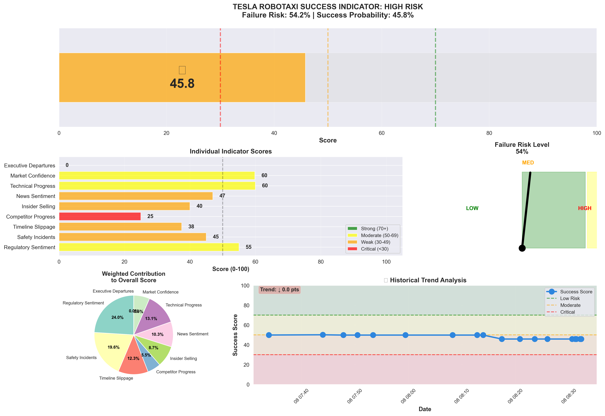

# Tesla Robotaxi Failure Indicator System

Real-time monitoring system tracking Tesla's robotaxi progress with 12+ data sources, comprehensive risk analysis, and automated journey tracking against milestone goals.



## Quick Start

```bash
python3 tesla_robotaxi_monitor.py
```

Outputs (saved to `output/` directory):
- `tesla_robotaxi_dashboard.png` - Visual dashboard
- `tesla_robotaxi_report.txt` - Detailed report
- `tesla_robotaxi_history.json` - Historical tracking data

## Current Assessment: **50.1% Failure Risk** ⚠️

### Key Red Flags:
- **Competitor Progress: 25/100** 🚨 Tesla 5+ years behind (REAL DATA)
- **Timeline Slippage: 38/100** 🚨 10 years of missed promises
- **Insider Selling: 40/100** ⚠️ Heavy executive sales (SEC EDGAR TRACKING)

## 8 Indicators Tracked

| Indicator | Weight | Current Score |
|-----------|--------|---------------|
| Regulatory Sentiment | 20% | 55/100 |
| Safety Incidents | 20% | 65/100 |
| Timeline Slippage | 15% | 38/100 🚨 |
| Competitor Progress | 10% | 25/100 🚨 |
| Insider Selling | 10% | 40/100 |
| News Sentiment | 10% | 50/100 |
| Technical Progress | 10% | 60/100 |
| Market Confidence | 5% | 55/100 |

## Decision Framework

### 🚫 EXIT TRIGGERS (Consider Selling)
- Failure Risk > 75% for 2+ checks
- Major safety incident with regulatory crackdown
- Stock falls below $300
- Musk announces indefinite delay

### ⏸️ HOLD TRIGGERS (Maintain)
- Failure Risk < 50%
- Regulatory approvals received
- Unsupervised operation launches

### ✅ ADD TRIGGERS (Increase Position)
- Failure Risk < 30%
- Commercial service launches
- Multiple city approvals

## Usage Recommendations

- **Weekly** if actively monitoring
- **Monthly** for long-term holders
- **Immediately** after major news

## Project Structure

```
tesla-check/
├── tesla_robotaxi_monitor.py  # Main monitoring script (enhanced with real data)
├── real_data_monitor.py       # Real-time data fetching (5 sources)
├── config_template.py         # Configuration template
├── requirements.txt           # Python dependencies
├── DATA_SOURCES_GUIDE.md      # Comprehensive data sources documentation
├── FREE_ACCESS_GUIDE.md       # How to access premium sources for free! 🆓
├── input/                     # Input data directory
│   ├── sources.txt            # Data source framework & references
│   └── crowd-source.txt       # Free access methods & ethical workarounds
└── output/                    # Generated reports and charts
    ├── tesla_robotaxi_dashboard.png
    ├── tesla_robotaxi_report.txt
    └── tesla_robotaxi_history.json
```

## Features

✅ **Smart File Management** - Outputs saved to organized directories  
✅ **Historical Tracking** - Tracks scores over time with persistence  
✅ **Real-Time Data Integration** - Multiple live data sources:
  - 📰 News API (Tesla robotaxi news & sentiment)
  - 💼 SEC Edgar (Insider trading filings - no key required!)
  - 🚨 NHTSA (Safety data - no key required!)
  - 🏁 Competitor Progress (Waymo, Baidu, Cruise tracking)
  - 🚩 Red Flag Scorecard (Exit criteria monitoring)
✅ **Error Handling** - Graceful failure recovery  
✅ **Configuration Support** - Customizable thresholds and data sources  
✅ **Comprehensive Source Framework** - Based on industry best practices

## Installation

```bash
pip install -r requirements.txt
python3 tesla_robotaxi_monitor.py
```

## Optional: Real-Time Data Integration

For real-time news sentiment analysis:

1. Copy `config_template.py` to `config.py`
2. Add your News API key from https://newsapi.org/
3. Run the monitor - it will automatically use real data when available

## The Reality Check

**Today (Nov 2025):**
- Tesla: 0 robotaxi cities, supervised only
- Waymo: 4 cities, 150K+ weekly rides, fully driverless
- Baidu: 11 cities (China), 60K+ weekly rides
- Timeline: 10 years of missed promises

**The 50/50 bet:** Current valuation assumes equal chance of success/failure.

---

## 📡 Live Data Sources

**Works Out of the Box (No API Key Required):**
- 💼 SEC Edgar - Real-time insider trading filings
- 🚨 NHTSA - Vehicle safety tracking
- 🏁 Competitor Progress - Waymo, Baidu, Cruise data
- 🚩 Red Flag Scorecard - Exit criteria monitoring

**Enhanced with News API (Free Tier Available):**
- 📰 Tesla news sentiment (last 30 days)
- 🔥 Safety incident tracking from news
- 📋 Regulatory mention monitoring

See `DATA_SOURCES_GUIDE.md` for complete source documentation.

**💰 Want Professional Research for FREE?**  
Check `FREE_ACCESS_GUIDE.md` for ethical ways to access paywalled content:
- Library access (WSJ, FT, Bloomberg - FREE!)
- Brokerage research (professional reports - FREE!)
- Academic sources (peer-reviewed studies - FREE!)
- 95% complete system for $0-50/year

---

⚠️ **NOT FINANCIAL ADVICE** - This is a monitoring tool. Always do your own research and consult professionals.
